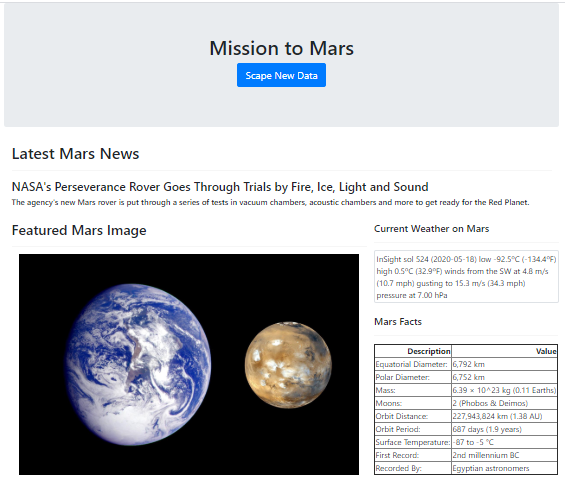
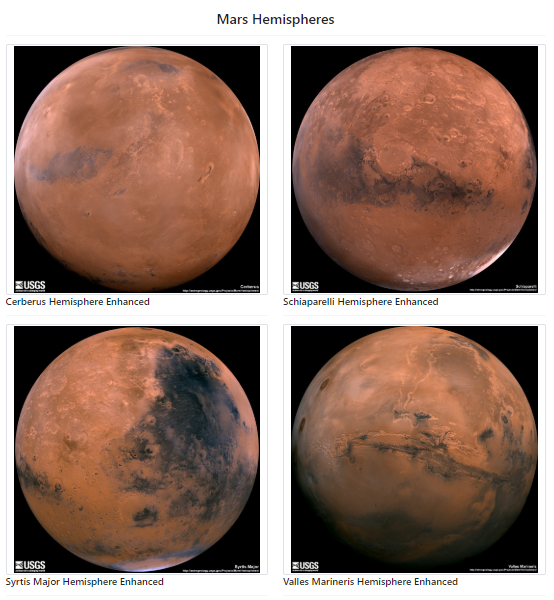

## Web Scraping - Mission to Mars

Background: Build a flask web application that scrapes various websites for data related to the Mission to Mars and displays the information in a single HTML page. 

### Step 1 - Scraping

Initial scraping using Jupyter Notebook, BeautifulSoup, Pandas, and Requests/Splinter.

#### NASA Mars News

* Scrape the [NASA Mars News Site](https://mars.nasa.gov/news/) and collect the latest News Title and Paragraph Text.  

#### JPL Mars Space Images - Featured Image

* Visit the url for JPL Featured Space Image [here](https://www.jpl.nasa.gov/spaceimages/?search=&category=Mars).

* Use splinter to navigate the site and find the image url for the current Featured Mars Image.

#### Mars Weather

* Visit the Mars Weather twitter account [here](https://twitter.com/marswxreport?lang=en) and scrape the latest Mars weather tweet from the page. 

#### Mars Facts

* Visit the Mars Facts webpage [here](https://space-facts.com/mars/) and use Pandas to scrape the table containing facts about the planet including Diameter, Mass, etc.

#### Mars Hemispheres

* Visit the USGS Astrogeology site [here](https://astrogeology.usgs.gov/search/results?q=hemisphere+enhanced&k1=target&v1=Mars) to obtain high resolution images for each of Mar's hemispheres.

### Step 2 - MongoDB and Flask Application

Use MongoDB with Flask templating to create a new HTML page that displays all of the information that was scraped from the URLs above.

* Create a route called `/scrape` that will import your `scrape_mars.py` script and call `scrape` function.

* Store the return value in Mongo as a Python dictionary.

* Create a root route `/` that will query Mongo database and pass the mars data into an HTML template to display the data.

* Create a template HTML file called `index.html` that will take the mars data dictionary and display all of the data in the appropriate HTML elements. 

### Resulting Page

##### Notes

* Use Splinter to navigate the sites when needed and BeautifulSoup to help find and parse out the necessary data.

* Use Pymongo for CRUD applications for your database. For this homework, you can simply overwrite the existing document each time the `/scrape` url is visited and new data is obtained.

* Use Bootstrap to structure your HTML template.

###### Copyright

Trilogy Education Services © 2019. All Rights Reserved.
